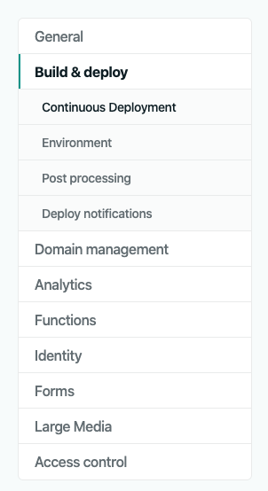
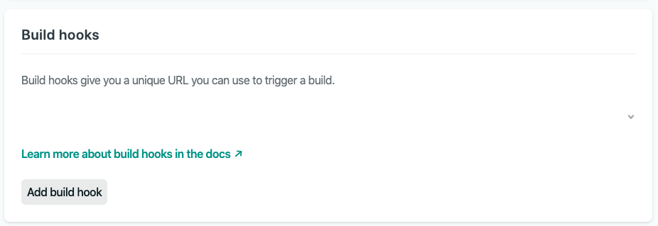
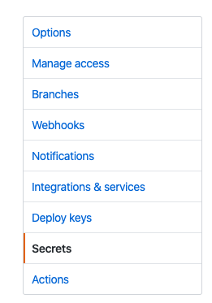

My ongoing focus has been an emphasis on reducing as much friction as I can in writing and publishing. The consideration of ideas and knowledge, and translating them to my own words and mental models, still has a lot of value. Conversely, the manual and repetitive effort of publishing, of saving files and making git pushes, does not for me. There may be windows of time in which I generate a lot of content. Ostensibly, a theme of popular online publishing outlets is that there is a _consistent_ delivery of quality content, rather than an _inconsistent_ and bursty model. How to reconcile _inconsisent content generation_ with _consistent content publishing_?

[Hugo](https://gohugo.io/), the software this blog is built with, allows you to define a future date of publication. However, for this to be triggered, the "engine" of the blog still has to rebuild the content. [Netlify](https://www.netlify.com/) provides a modern, CDN-esque platform for hosting static websites and blogs. One of their features includes providing a build "hook", which is a unique URL, that when visited, will trigger a rebuild of the site. When combined with [Github Actions](https://github.com/features/actions), I can have my site automatically rebuild itself every midnight, automatically publishing any post-dated content.


## Prerequisites 

If you want to duplicate this functionality, you will need:

-   A static site generator. I use Hugo. Other options include Jekyll, Gatsby, and Nuxt.
-   Site content in version control like Github or Gitlab.
-   Netlify hosting for your static site.
-   If not Github actions, some other kind of cron-emulation service.


## Generate A Build Hook 

The first thing I did was generate a unique build hook in my "Site Settings" in the Netlify admin UI:

<figure>
  
</figure>

...went to "Build & deploy":

<figure>
  
</figure>

...and finally added a "Build hook":

<figure>
  
</figure>

Once added, the build hook will be a Netlify API URL, with a unique alphanumeric identifier. Calls to this URL will trigger a site rebuild on Netlify. Now I can input this URL into Github Actions.


## Automatically Trigger The Build Hook With Github Actions 

I originally set this up using the UI, as I wanted to explore it a bit, but it's a lot more efficient to create and commit a file from the IDE.

First, I would create the directory structure needed for Github to interpret a valid action config(this command would be done in the root directory of the blog):

```bash
$ mkdir -p .github/workflows
```

Then, I create a file in the "workflows" directory named "main.yml":

```bash
$ touch .github/workflows/main.yml
```

The contents are as follows:

```yaml
name: auto-build

on:
  schedule:
	- cron: '0 5 * * *'

jobs:
  build:

	runs-on: ubuntu-latest

	steps:
	- name: Trigger Netlify build
	  run: curl -X POST -d '{}' https://api.netlify.com/build_hooks/${{ secrets.NETLIFY_HOOK }}
```

With this workflow definition, the Netlify build hook will be triggered daily, at EST midnight.

I want to avoid exposing my build hook id publicly, as that means anyone could trigger a build of my site, and possibly get my Netlify API access throttled or locked. For the last step, I'll set up a Github secret that can be interpolated in my config.


## Define a Github Secret 

First, I go to repo "Settings":

<figure>
  
</figure>

...then "Secrets":

<figure>
  
</figure>

I clicked "Add a new secret", named it "NETLIFY\_HOOK", and populated the value with the URL id. Now, whenever I want to have that secret available in a config, without revealing it, I can interpolate it with the following syntax:

```yaml
${{ secrets.NETLIFY_HOOK }}
```
## Summary 

With minimal config and effort, I've got automation to rebuild every midnight, at which point any approriately dated post will then be published.
