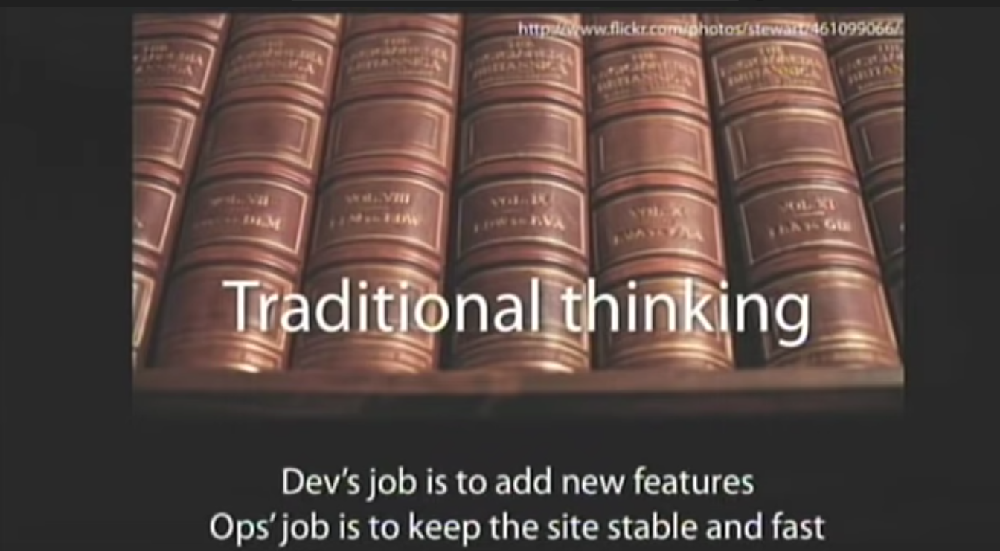

Lately there seems to be a growing chorus within software engineering that DevOps is "dead", or at least an abject failure.

I'd argue it is more important than ever before. Software delivery is an increasingly complex beast, fraught with security threats and requiring a pragmatic and nuanced approach to operational excellence. Engineering organizations cannot afford to maintain development teams with the attitude that they should not have to care at all about anything outside the scope of writing code.

## When Did We Get So Precious About Development Work? 

Devs saying that they shouldn't have to do ops or have any concern for the underlying infrastructure sounds like a familiar refrain... where have we all heard that before?

Look familiar? It should.

Here's a hint: <YouTube id="https://youtu.be/LdOe18KhtT4?t=221">

It's from the original Allspaw/Hammond presentation on DevOps, way back in 2009.

"Traditional thinking" was the anti-pattern; the old way of doing things that had Dev and Ops in separate silos, with devs only concerned about "shipping code" and ops staff making it run. If we're back to devs not needing to care about infrastructure and operational concerns, then it really feels like we've made a full-circle return to the waterfall days of development.

Bridge builders do not get to claim ignorance as to the nature of cars and trucks, or the lead time required to make safe structural steel, and yet here we are.

DevOps **will** be opinionated and force things on developers, because, well, some things aren't really optional...

## DevOps Often Becomes The Proxy Enforcer of Security Policy... 

If you think the ratio of DevOps engineers to developers in your company is thin, have you looked at the ratio of security engineers to all other employees?

Yeah...

Thus, it is often left to DevOps teams building out workload and deployment systems to also be the proxy enforcer of security policy via these very systems.

Security policies by nature tend to be very opinionated, and are generally viewed as being "in the way" of feature iteration. They also happen to be in the way for a very good reason:

<https://blog.gitguardian.com/the-state-of-secrets-sprawl-2022/>

From their report:

> The data reveals that on average, in 2021, a typical company with 400 developers would discover 1,050 unique secrets leaked upon scanning its repositories and commits. With each secret detected in 13 different places on average, the amount of work required for remediation far exceeds current AppSec capabilities: with a security-to-developers ratio of 1:100, 1 AppSec engineer needs to handle 3,413 secrets occurrences on average.

Yikes.

No, we cannot make developers learn, or care about, something like Terraform, or whatever other ops tooling or process we try to convince everyone is needed. What we **shouldn't** have to do is justify the use of tools or processes that takes us to a more secure, more operationally excellent posture; even if it means some perceived inconvenience to developer productivity.

I absolutely concur that the idea of a [platform team](https://twitter.com/iamvlaaaaaaad/status/1534489514818686976?s=20&t=DKztUBFm7eYEo9PoReOniw) ends up being **too** opinionated; the golden path turns into a fixed point-in-time lock-in that will never keep up with the pace of iteration by the parent platform provider.

However, enforcing standards and secure software delivery is probably an opinion that would benefit the overall health(and continued existence of the business). Even something banal as getting resources named and tagged correctly can be important because...

## ... and the Torch-Bearer for Audit Compliance as well 

Anyone that's ever been beholden to a compliance framework or regular audits knows that it is a time-consuming, nerve-wracking, stressful process. Auditors often ask for(as they should) very detailed, granular questions about specific processes and systems. These questions typically demand some form of paper trail(typically in the form of logs) that can establish time, date, and metadata for a particular event.

A hypothetical audit request might read like:

> "According to the logs of this critical_datastore, Developer A accessed this piece of data. Please provide a timestamped log of your application control plane, showing that the developer followed the correct access pattern and used 2FA for authentication"

Sure. No problem.

> Except there are 25 nodes that classify as "control planes".
>
> Why are some named with this scheme: "controlPlane-01", others named with: "ControlP2", and one just named "-07"???
>
> Ugh. Fine, no problem. I'll just look at the log aggregator where all these stream to.
>
> Ok no log aggregation, of course that was stupid to assume. Welp.
>
> I guess I'll just have to look at each node's logs individually.
>
> Ahahahahahahahahahaha why did I dare let hope's light illuminate the darkness only for it to be extinguished?

Enforcing even the boring stuff like naming pays dividends later when it comes time to hopefully present auditors with a picture that your organization is at least making a good-faith effort to comply with the rules.

## So What's The Answer? 

I think DevOps teams should absolutely be out of the way when it comes to platform and implementation choice. If the product team A wants to use serverless infrastructure, product team B wants containers, and product team C just needs an S3 bucket to host pictures, so be it. DevOps should be able to provide modular, primitive infrastructure patterns that allow developers to take advantage of the infrastructure that best suits their needs.

**However..**

This cannot and should not imply that it's Wild West time. If product A's choice of serverless means there are extra development cycles needed to implement proper security controls and sane operational patterns then **that's the cost of business continuity** and developers are going to have to care about it whether it's part of their KPIs or not. It takes time to build even the most unobtrusive of guardrails in such a way that they are both **unobtrusive and actually effective at their stated purpose.**

These folks also _might_ know a thing or two about the problem space:

<https://itrevolution.com/accelerate-book/>

> ... "We speculate that this is due to low-performing teams working to increase tempo but not investing enough in building quality into the process. The result is larger deployment failures that take more time to restore service. High performers understand that they don’t have to trade speed for stability or vice versa, because by building quality in they get both."
